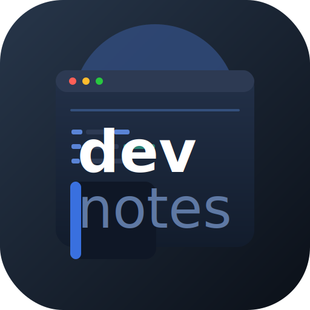

<p align="center">
  
</p>

<p align="center">
  <strong>devnote</strong>
</p>

<h1 align="center">Kişisel Programlama Notları Kitaplığı</h1>

<p align="center">
  Java, JavaScript, Python, SQL ve MongoDB notları tek yerde. Markdown odaklı, hızlı aranabilir, CLI ve web arayüzü ile gezilebilir.
</p>

<p align="center">
  <strong>Sıfır bağımlılık</strong>
  &nbsp;·&nbsp;
  <strong>İnteraktif TUI</strong>
  &nbsp;·&nbsp;
  <strong>Tarayıcı tabanlı okuyucu</strong>
</p>

<p align="center">
  <a href="https://www.npmjs.com/package/devnotetr"></a>
  <a href="https://www.npmjs.com/package/devnotetr"></a>
  <a href="LICENSE.md"></a>
</p>

---

## Genel Bakış

devnote, kişisel çalışma notlarını düzenli bir kitaplık halinde toplar. Her not Markdown formatındadır; istersen terminalden ara, istersen tarayıcıdan oku, istersen editörde aç.

## Hızlı Bakış

| Alan       | İçerik                                               |
| ---------- | ---------------------------------------------------- |
| Java       | Lombok, JPA / Hibernate, Spring Boot                 |
| JavaScript | Array metodları, closure, currying, async, regex     |
| Python     | Temel konular, ileri teknikler, veritabanı işlemleri |
| SQL        | Temel sorgular, ileri SQL, psql terminal kullanımı   |
| MongoDB    | Temel CRUD ve sorgulama                              |

## Kullanım

Node.js kurulu olması yeterlidir; harici paket gerekmez.

### Komutlar

| Komut                                      | Açıklama                             |
| ------------------------------------------ | ------------------------------------ |
| `devnote help`                             | Komutları göster                     |
| `devnote list`                             | Tüm notları listele                  |
| `devnote list --cat java`                  | Java kategorisindeki notları göster  |
| `devnote list --cat py --search temel`     | Python notları arasında "temel" ara  |
| `devnote search hibernate`                 | Tüm notlarda "hibernate" araması yap |
| `devnote open 3`                           | 3 numaralı notu editörde aç          |
| `devnote open --tui`                       | İnteraktif TUI modunu başlat         |
| `devnote open --editor`                    | Web arayüzünü tarayıcıda aç          |
| `devnote open --browser 6`                 | 6 numaralı notu tarayıcıda aç        |

### TUI Tuş Kombinasyonları

| Tuş       | Eylem         |
| --------- | ------------- |
| ↑ / ↓     | Gezin         |
| Enter     | Seç / aç      |
| p         | Markdown önizle  |
| e         | Editörde aç   |
| b         | Tarayıcıda aç |
| Backspace | Geri          |
| q         | Çık           |

## Web UI

`library/index.html` dosyası üzerinden çalışan basit bir arayüz vardır.

- Kategori filtreleme
- Anlık arama
- Kart üzerinden not detayını görme

## Gereksinimler

- [Node.js](https://nodejs.org) 18 veya üzeri

## Kurulum

```bash
npm install -g devnotetr
devnote help
```

Paket sayfası: [npmjs.com/package/devnotetr](https://www.npmjs.com/package/devnotetr)

## Proje Yapısı

```text
dev-notes/
  Java-Notes/
    lombok.md
    jpa_hibernate.md
    spring_boot_framework.md
  Javascript-Notes/
    javascirpt_array_methods.md
    closures_currying_compose.md
    async_js.md
    regex_part_1.md
  Python-Notes/
    python_basic_1.md  …  python_basic_3.md
    advanced_python_1.md  advanced_python_2.md
    python_db_process.md
  SQL-Notes/
    sql_basic_1.md  sql_basic_2.md
    sql_advanced_1.md
    psql_on_terminal.md
  MongoDB-Notes/
    mongodb_basic_1.md
  library/
    index.html          Web UI
    cli.js              CLI aracı
    README.md           Kitaplık giriş noktası
```

## Lisans

MIT. Ayrıntılar için [LICENSE](LICENSE.md) dosyasına bakın.

---

<p align="center">Burak Boduroğlu</p>
